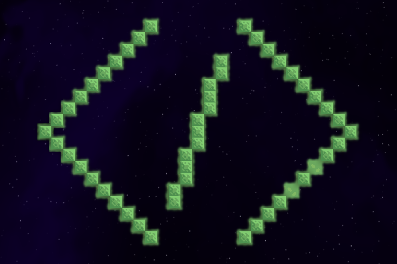

# Mindustry Test Mod

A simple Mindustry mod, written in Java, to test what is possible.

## Items

### Red

A blob of the colour red, for building red blocks. Currently cannot be obtained.

## Blocks

### Red wall

Build cost: 10 copper

Health: 600

### Large red wall

Build cost: 50 copper

Health: 3000
